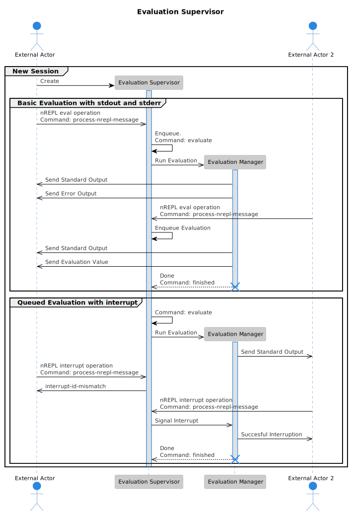
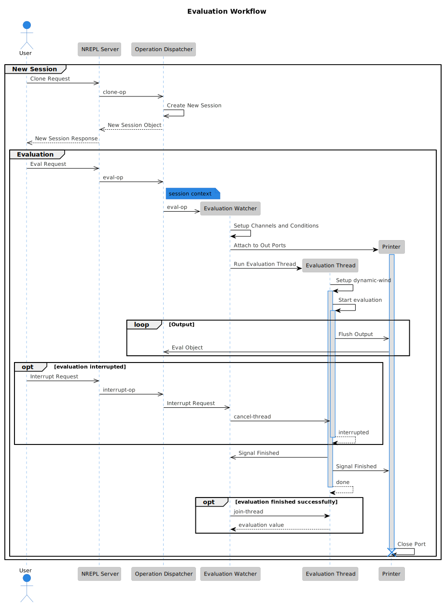

* Architecture                                                       :noexport:
#+begin_src plantuml :file diagrams/eval-thread-states.svg
@startuml
/'
 ' scale 350 width
 '/
state ForkState <<fork>>
[*] --> ForkState
ForkState --> EvaluationThread
ForkState --> EvaluationThreadManager

state EvaluationThread {
        [*] --> Idle
        Idle --> Running : Scheduled
        Running --> ReturningValue1 : Finished
        Running --> ReturningValue2 : Interrupted
        Idle --> ReturningValue3 : Interrupted

        /'
         ' ReturningValue -[dotted]-> EvaluationThreadManager : Returned Value
         '/

}
state EvaluationThreadManager {
        state "Waiting" as TWait
        TWait: Waiting for Command or Thread Value
        [*] --> TWait
        TWait --> RunEval : Eval Command Received
        TWait --> Interrupt : Interrupt Command Received
        state Interrupt {
                Try -[dotted]-> EvaluationThread : Interrupt

        }
        RunEval -[dotted]-> EvaluationThread : Schedule

}
/'
 ' state Configuring {
 '         [*] --> NewValueSelection
 '         NewValueSelection --> NewValuePreview : EvNewValue
 '         NewValuePreview --> NewValueSelection : EvNewValueRejected
 '         NewValuePreview --> NewValueSelection : EvNewValueSaved
 '
 '         state NewValuePreview {
 '                 State1 -> State2
 '         }
 '
 ' }
 '/
@enduml
#+end_src

#+begin_src plantuml :file diagrams/ares-architecture.svg
@startuml
!theme reddress-lightblue
/' needed for &, but unfortunatelly breaks diagram '/
/'
 ' !pragma teoz true
 '/

title Ares-rs Architecture

actor "nREPL Client" as Client
participant "Ares Server" as Server
participant "Socket" as Socket
participant "Event Loop Fiber" as EventLoop
participant "Evaluation Thread" as EvaluationThread

group New Connection
        Client -> Server: Establish Connection
        Server -> Socket **: Create Socket
        Server -> EventLoop **: Setup Event Loop

        EventLoop -> Client: Connection Established
end

group Eval Processing
        Socket ->> EventLoop: Evaluation Request (eval op)
        EventLoop ->> EvaluationThread: Schedule Evaluation
        EvalutaionThread ->> Socket: Reply 1
        EvalutaionThread ->> Socket: Reply 2
        EvalutaionThread ->> Socket: Evaluation Value
end

/'
 ' participant "Evaluation Supervisor" as Supervisor
 ' participant "Evaluation Manager" as Manager
 ' actor "External Actor 2" as Actor2
 '/
/'
 ' group New Session
 '         Actor -> Supervisor **: Create
 '         activate Supervisor
 '         group Basic Evaluation with stdout and stderr
 '                 Actor ->> Supervisor: nREPL eval operation\nCommand: process-nrepl-message
 '
 '                 Supervisor -> Supervisor: Enqueue.\nCommand: evaluate
 '                 Supervisor ->> Manager **: Run Evaluation
 '                 activate Manager
 '                 Manager ->> Actor: Send Standard Output
 '                 Manager ->> Actor: Send Error Output
 '                 Actor2 ->> Supervisor: nREPL eval operation\nCommand: process-nrepl-message
 '                 Supervisor -> Supervisor: Enqueue Evaluation
 '                 Manager ->> Actor: Send Standard Output
 '                 Manager ->> Actor: Send Evaluation Value
 '                 return Done\nCommand: finished
 '                 destroy Manager
 '         end
 '         group Queued Evaluation with interrupt
 '
 '                 Supervisor -> Supervisor: Command: evaluate
 '
 '                 Supervisor ->> Manager **: Run Evaluation
 '                 activate Manager
 '                 Manager ->> Actor2: Send Standard Output
 '                 Actor ->> Supervisor: nREPL interrupt operation\nCommand: process-nrepl-message
 '                 Supervisor ->> Actor: interrupt-id-mismatch
 '
 '                 Actor2 ->> Supervisor: nREPL interrupt operation\nCommand: process-nrepl-message
 '                 Supervisor ->> Manager: Signal Interrupt
 '
 '                 Manager ->> Actor2: Succesful Interruption
 '                 return Done\nCommand: finished
 '                 destroy Manager
 '         end
 '         deactivate Supervisor
 ' end
 '/
@enduml
#+end_src

#+begin_src plantuml :file diagrams/evaluation-suprevisor.svg
@startuml
!theme reddress-lightblue
/' needed for &, but unfortunatelly breaks diagram '/
/'
 ' !pragma teoz true
 '/

title Evaluation Supervisor

actor "External Actor" as Actor
participant "Evaluation Supervisor" as Supervisor
participant "Evaluation Manager" as Manager
actor "External Actor 2" as Actor2
group New Session
        Actor -> Supervisor **: Create
        activate Supervisor
        group Basic Evaluation with stdout and stderr
                Actor ->> Supervisor: nREPL eval operation\nCommand: process-nrepl-message

                Supervisor -> Supervisor: Enqueue.\nCommand: evaluate
                Supervisor ->> Manager **: Run Evaluation
                activate Manager
                Manager ->> Actor: Send Standard Output
                Manager ->> Actor: Send Error Output
                Actor2 ->> Supervisor: nREPL eval operation\nCommand: process-nrepl-message
                Supervisor -> Supervisor: Enqueue Evaluation
                Manager ->> Actor: Send Standard Output
                Manager ->> Actor: Send Evaluation Value
                return Done\nCommand: finished
                destroy Manager
        end
        group Queued Evaluation with interrupt

                Supervisor -> Supervisor: Command: evaluate

                Supervisor ->> Manager **: Run Evaluation
                activate Manager
                Manager ->> Actor2: Send Standard Output
                Actor ->> Supervisor: nREPL interrupt operation\nCommand: process-nrepl-message
                Supervisor ->> Actor: interrupt-id-mismatch

                Actor2 ->> Supervisor: nREPL interrupt operation\nCommand: process-nrepl-message
                Supervisor ->> Manager: Signal Interrupt

                Manager ->> Actor2: Succesful Interruption
                return Done\nCommand: finished
                destroy Manager
        end
        deactivate Supervisor
end
@enduml
#+end_src

#+RESULTS:

#+begin_src plantuml :file diagrams/eval.svg
@startuml
/'
 ' !theme cerulean-outline
 ' !theme plain
 ' !theme reddress-lightblue
 ' !theme sketchy-outline
 ' !theme vibrant
'/
!theme reddress-lightblue
title Evaluation Workflow

actor User
participant "NREPL Server" as Server
participant "Operation Dispatcher" as Dispatcher
participant "Evaluation Watcher" as Watcher
participant "Evaluation Thread" as Thread

/'
 ' group Connection
 '         User -> Server: Establish Connection
 '         Server -> Server: Create Socket
 '         Server -> User: Acknowledge
 ' end
 '
 '/
group New Session
        User ->> Server: Clone Request
        Server ->> Dispatcher: clone-op
        Dispatcher ->> Dispatcher: Create New Session
        Dispatcher -->> Server: New Session Object
        Server -->> User: New Session Response

        group Evaluation
                User ->> Server: Eval Request
                Server ->> Dispatcher: eval-op
                note right Dispatcher: session context
                Dispatcher ->> Watcher **: eval-op
                Watcher -> Watcher: Setup Channels and Conditions
                Watcher -> Printer **: Attach to Out Ports
                activate Printer
                Watcher -> Thread ** : Run Evaluation Thread
                Thread -> Thread ++: Setup dynamic-wind
                Thread -> Thread ++: Start evaluation

                loop Output
                        Thread ->> Printer: Flush Output
                        Printer ->> Dispatcher: Eval Object
                end

                opt evaluation interrupted
                        User ->> Server: Interrupt Request
                        Server ->> Dispatcher: interrupt-op
                        Dispatcher ->> Watcher: Interrupt Request
                        Watcher ->> Thread: cancel-thread
                        return interrupted
                end
                Thread ->> Watcher: Signal Finished
                Thread ->> Printer: Signal Finished
                return done
                opt evaluation finished successfully
                        Watcher -> Thread: join-thread
                        Thread --> Watcher: evaluation value
                end

                Printer -> Printer !!: Close Port
                deactivate Printer
                deactivate Thread
        end
end

@enduml
#+end_src

#+RESULTS:

